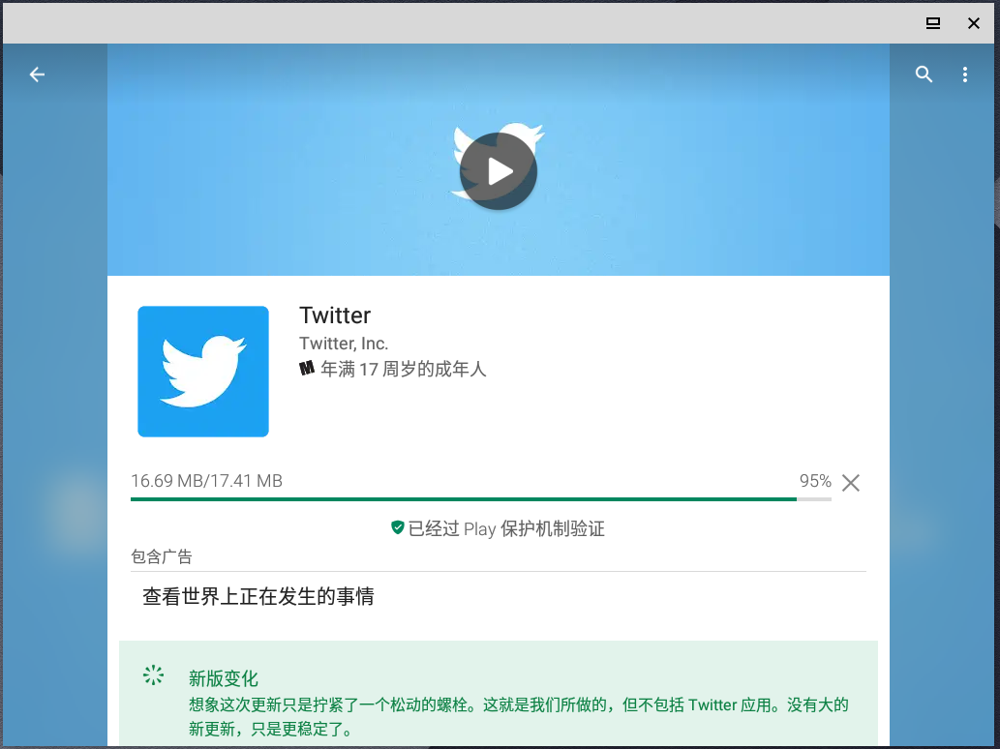

# anbox-playstore-installer

## forked from geeks-r-us/anbox-playstore-installer
* 此脚本将会在anbox中安装google play store及启用ARM支持
* 请先挂全局代理，并编辑文件中的proxy_port为自己的代理端口
* 安装完成后会自动配置anbox的代理，登陆过程中google play可能会卡死或闪退几次
* 完成后生成的anbox-work文件夹可删除
* 会在ln -s ~/.local/share/applications创建软连接到～/snap/anbox/common/app-data/applications/anbox，安装新程序会自动创建图标，如不需要可删除

## screenshot

## introduction
Install script that automates installation of googles playstore in anbox (an LX container based environment to run Android apps on Linux https://www.anbox.io/ )

A detailed description of the installation steps can be found under: 
~~https://geeks-r-us.de/2017/08/26/android-apps-auf-dem-linux-desktop/~~
https://geeks-r-us.de/2018/09/04/anbox-update-overlay/

Tested with Anbox Snap 145

If you find this piece of software useful and or want to support it's development think of buying me a coffee https://www.buymeacoffee.com/YdV7B1rex
